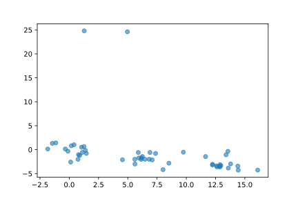
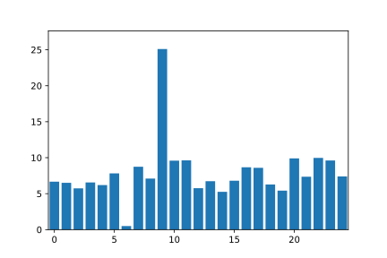
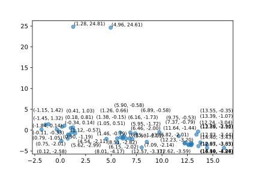
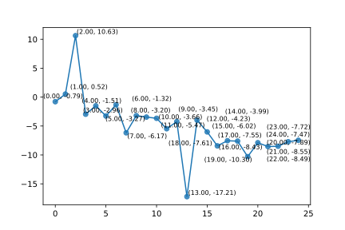

# SVG taxonomy

This repo hosts the supplemental material as a submission to IEEE VIS 2024

**Exploring the Capability of LLMs in Performing Low-Level Visual Analytic Tasks on SVG Data Visualizations**

Zhongzheng Xu, Emily Wall

*IEEE Transactions on Visualization and Computer Graphics (TVCG, Proc. IEEE VIS'24). 2024.*

## Abstract 
Data visualizations help extract insights
from datasets, but reaching these insights requires decomposing
high level goals into low-level analytic tasks that can be complex
due to varying data literacy and experience. Recent advancements
in large language models (LLMs) have shown promise for lowering
barriers for users to achieve tasks such as writing code. Scalable
Vector Graphics (SVG), a text-based image format common in data
visualizations, matches well with the text sequence processing of
transformer-based LLMs. In this paper, we explore the capability of
LLMs to perform low-level visual analytic tasks defined by Amar,
Eagan, and Stasko directly on SVG-based visualizations. Using
zero-shot prompts, we instruct the models to provide responses or
modify the SVG code based on given visualizations. Our findings
demonstrate that LLMs can effectively modify existing SVG visu-
alizations for specific tasks like Cluster but perform poorly on tasks
requiring a sequence of math operations. We also discovered that
LLM performance varies based on factors such as the number of
data points, the presence of value labels, and the chart type. Our
findings contribute to gauging the general capabilities of LLMs and
highlight the need for further exploration and development to fully
harness their potential in supporting visual analytic tasks.

## SVG Visualizations
This repository contains examples of three chart types (scatterplot, line chart, and bar chart) with varying plot difficulties used in our study. The visualizations are generated using Python scripts and saved as SVG files.
### Chart Types and Difficulties
The following table summarizes the chart types and their corresponding difficulties:
| Difficulty | Scatterplot | Line Chart | Bar Chart|
|------------|-------------|------------|----------|
| Small Unlabeled  |  |  |  |
| Small Labeled    |  |  |  |
| Medium Unlabeled |  |  |  |
| Medium Labeled   |  |  |  |

The characteristics of each chart type and difficulty level are as follows:
| Chart Type        | Data Points/Bins | Outliers | Clusters |
|-------------------|------------------|----------|----------|
| Scatter (Small)  | 20               | 1        | 2        |
| Scatter (Medium) | 50               | 2        | 3        |
| Bar (Small)      | 10               | 1        | N/A      |
| Bar (Medium)     | 25               | 2        | N/A      |
| Line (Small)     | 10               | 1        | N/A      |
| Line (Medium)    | 25               | 2        | N/A      |

### Data Generation and Plotting

Data points for creating the plots are generated using `data_generation/gen_data.py`. The script can be run with command-line arguments to specify the number of data points, chart type, and number of separate datasets to generate. For example:

`python3 gen_data.py --data_type scatter --n_points 30 --n_datasets 20 --output_folder {OUTPUT_PATH}`

The plots are then created using `data_generation/plot.py`. This script also accepts command-line arguments to specify the chart type, input and output folders, and whether to label the data points. For example:

`python plot.py --data_type scatter --input_folder {INPUT_PATH} --output_folder {OUTPUT_PATH} --label`

## Prompts
The prompts used in the study are located in `llm/prompt.json`. Each prompt corresponds to a low-level visual taxonomy that was tested. Here's an example prompt:

```
<input>: An SVG scatter plot with n points. The points are not labeled with their coordinates. The axes, title, legends, and other unnecessary elements are omitted for simplicity.

<output>: SVG code only and no other textual response

Instructions:

1. Identify the one outlier in the scatter plot, defined as data points that significantly deviate from the clusters.
2. Reconstruct the SVG scatter plot, coloring the outlier with a different color compared to the rest of the points.
3. Omit the axes, title, legends, and any other unnecessary elements in the reconstructed SVG.
4. Ensure that the reconstructed SVG contains only the data points, with the same number of points as the input SVG.
5. Include the necessary shape definitions in the reconstructed SVG code.Please provide the complete SVG code for the scatter plot with the outliers colored differently, without any additional textual response.

<input SVG scatterplot>: 
```

## Low-level Visual Taxonomy
To test the low-level visual tasks, we employed OpenAI's `gpt4-turbo-preview` model and used `llm/completion.py` to run the tests. This file allows us to asynchronously send multiple prompts to OpenAI's API and retrieve the results as a whole.

## Citation 
```
@article{xu2023vysical,
  title={Exploring the Capability of LLMs in Performing Low-Level Visual Analytic Tasks on SVG Data Visualizations},
  author={Xu, Zhongzheng and Wall, Emily},
  journal={IEEE Transactions on Visualization and Computer Graphics (TVCG)},
  year={2024},
  publisher={IEEE},
  url={todo}
}
```


