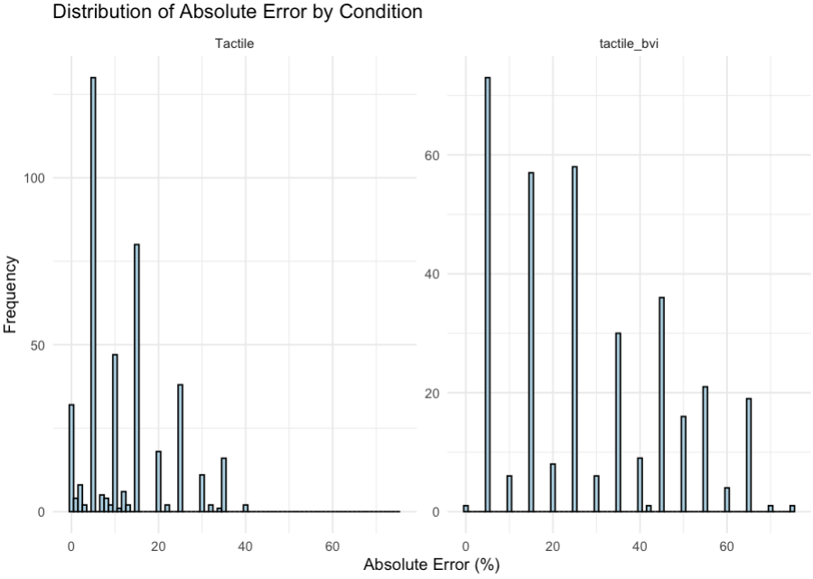
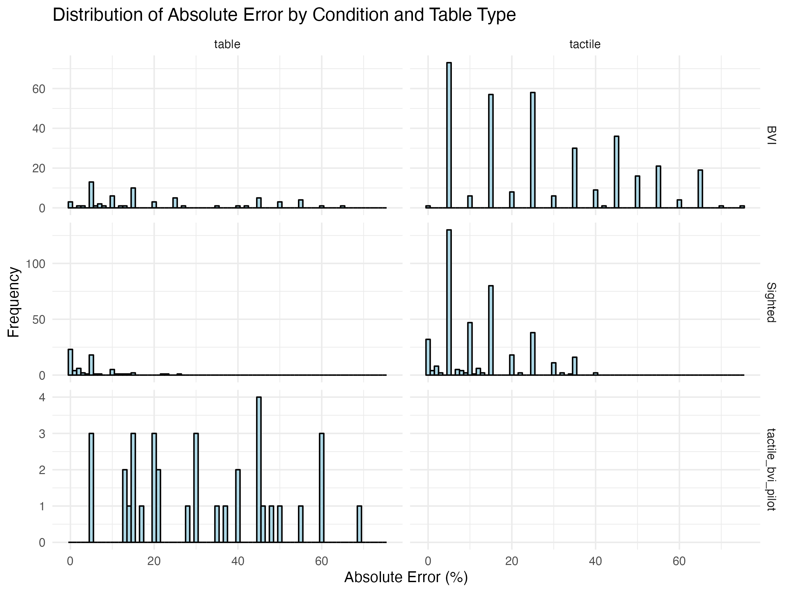
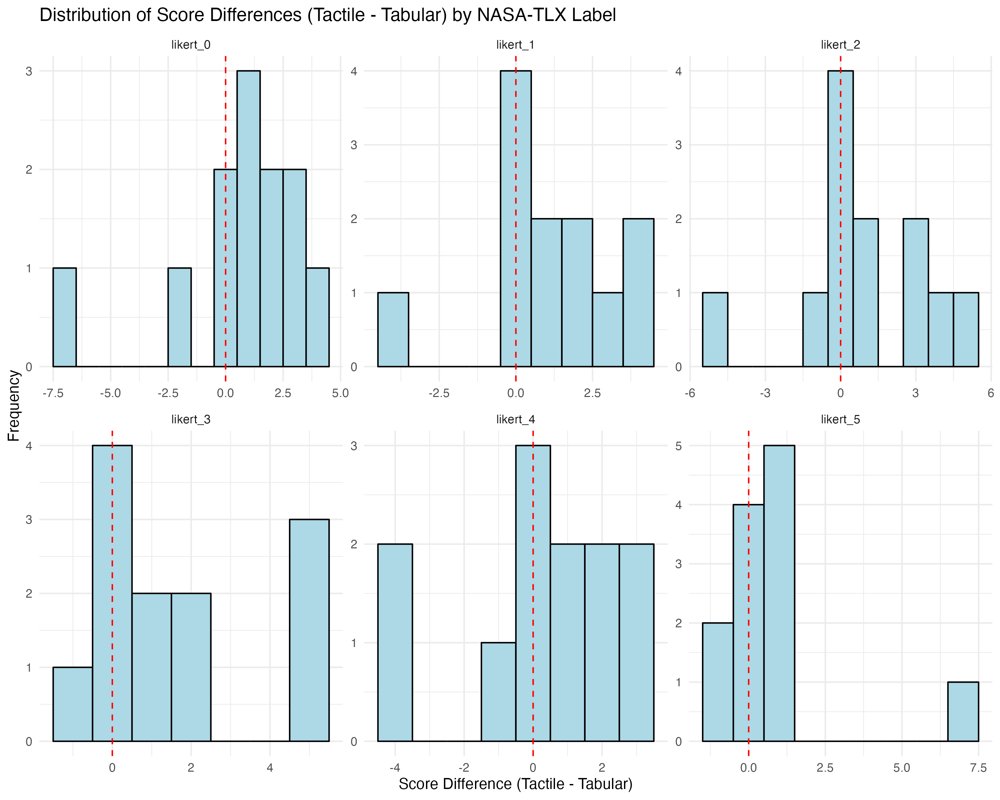

# Data Analysis Documentation

## Hypothesis 1

```
The PBVI group will more accurately identify the smaller of two stimuli using tactile encodings than the control group. We expect the PBVI group to have a higher tactile acuity, and so will be more accurate at perceiving tactile features relevant for comparing encoded values.
```

### Variables and Test
- **Dependent Variable**: `count_ones` (number of wrong forced choice answers)
- **Independent Variable**: `participant group` (BVI vs sighted)
- **Statistical Test**: Wilcoxon-Mann-Whitney Test (non-parametric test for comparing two independent groups)

### Assumptions 

| Assumption                     | Description                                                                                                                                                                                                | Testing Method | Checked |
| ------------------------------ | ---------------------------------------------------------------------------------------------------------------------------------------------------------------------------------------------------------- | -------------- | ------- |
| Independence                   | The observations from both samples must be **independent** of each other (no pairing or matching between samples).                                                                                         | N/A            | ✅       |
| Random  Sampling               | The samples should be **drawn randomly** from their respective populations.                                                                                                                                | N/A            | ✅       |
| Ordinal Measurement Scale      | The data should be at least **ordinal** (can be ranked).                                                                                                                                                   | N/A            | ✅       |
| Similar shape of distributions | While the test **doesn't require normal distributions**, traditionally it assumes that the distributions of both populations have similar shapes and variability, **differing only in location (median)**. | Plotting       | -       |
| Continuity                     | The underlying distributions should be continuous (though ties in the data can be handled).                                                                                                                | N/A            | ✅       |

#### Verifying Assumptions with Code

We used several methods to verify our assumptions:

1. **Visualizing Distributions**
```r
ggplot(fc_count, aes(x = count_ones)) +
  geom_histogram(binwidth = 1, fill = "lightblue", color = "black") +
  facet_wrap(~ condition, scales = "free_y")
```


2. **Testing Homogeneity of Variances**
```r
# Levene's test
leveneTest(count_ones ~ as.factor(condition), data = fc_count, center = median)
```
**Result**: F(1,22) = 11.233, p = 0.0029
- The significant p-value indicates that the variances are not equal between groups

```r
# Fligner-Killeen test
fligner.test(count_ones ~ as.factor(condition), data = fc_count)
```
**Result**: χ²(1) = 7.3974, p = 0.0065
- The non-parametric test also confirms significant differences in variances

### Results
|Participant Group|n|count_ones (mean (SD))|Total Wrong FC|p|test|
|---|---|---|---|---|---|
|Sighted|12|0.83 (0.83)|10|<0.001|-|
|BVI|12|6.92 (2.57)|83|-|-|

**Interpretation**: The PBVI group made significantly more errors per participant (mean = 6.92, SD = 2.57) compared to the sighted group (mean = 0.83, SD = 0.83) (p < 0.001). In total, the PBVI group made 83 errors, while the sighted group made 10 errors. This contradicts our hypothesis that PBVI participants would be more accurate with tactile encodings.

## Hypothesis 2
```
The PBVI group will perceive proportional differences between tactile stimuli more accurately in comparison to the sighted group.
```

### Variables and Test
- **Dependent Variable**: `abs_error` (absolute error in percentage)
- **Independent Variable**: `participant group` (BVI vs. sighted)
- **Statistical Test**: Aligned Rank Transform (ART) ANOVA

### Assumptions 

| Assumption                    | Description                                                                                                                                  | Testing Method         | Checked |
| ----------------------------- | -------------------------------------------------------------------------------------------------------------------------------------------- | ---------------------- | ------- |
| Independence                  | Observations within and between groups must be **independent** of each other (no correlation between measurements).                          | -                      | ✅       |
| Normality                     | The data within each group should follow a **normal distribution**. Less critical with larger sample sizes due to the Central Limit Theorem. | Aligned Rank Transform | ✅       |
| Homogeneity of Variances      | All groups should have **similar variances** (homoscedasticity).                                                                             | Levene's test          | -       |
| Continuous Dependent Variable | The outcome variable must be measured on a **continuous scale** (interval or ratio).                                                         | -                      | ✅       |
| Random Sampling               | Samples should be **randomly selected** from their respective populations.                                                                   | -                      | ✅       |
| No Significant Outliers       | Data should be free from **extreme values** that can disproportionately influence results.                                                   | Removing outliers      | ✅       |

#### Data Cleaning and Assumption Testing

1. **Outlier Removal**
```r
h2 <- df %>%
  group_by(condition) %>%
  filter(abs(abs_error - mean(abs_error, na.rm = TRUE)) <= 3 * sd(abs_error, na.rm = TRUE))
```
- Removed 11 outliers (771 → 760 data points)
- Used 3 standard deviations as cutoff

2. **Distribution Visualization**
```r
ggplot(h2, aes(x = abs_error)) +
  geom_histogram(binwidth = 1, fill = "lightblue", color = "black") +
  facet_wrap(~ condition, scales = "free_y")
```


3. **Normality Tests**
```r
normality_tests <- h2 %>%
  group_by(condition) %>%
  summarise(
    shapiro_p = shapiro.test(abs_error)$p.value
  )
```
**Results**:
- Tactile: p < 0.001
- tactile_bvi: p < 0.001
- Both groups show significant deviations from normality, justifying the use of ART

4. **Homogeneity of Variances Tests**
```r
# Levene's test
leveneTest(abs_error ~ as.factor(condition), data = h2, center = median)
```
**Result**: F(1,758) = 170.27, p < 0.001
- Significant difference in variances between groups

```r
# Fligner-Killeen test
fligner.test(abs_error ~ as.factor(condition), data = h2)
```
**Result**: χ²(1) = 139.96, p < 0.001
- Non-parametric test confirms significant variance differences

5. **Aligned Rank Transform (ART) Walkthrough**
The ART procedure involves several steps:

a. **Data Preparation**
```r
h2$condition <- factor(h2$condition)
h2$participant_id <- factor(h2$participant_id)
h2$type <- factor(h2$type)
h2 <- subset(h2, condition %in% c("Tactile", "tactile_bvi"))
```

b. **ART Model Fitting**
```r
art_h2 <- art(abs_error ~ condition + Error(participant_id), data=h2)
```
- Uses a mixed-effects model with participant as random effect
- Aligns and ranks the data to handle non-normality

c. **ANOVA on Transformed Data**
```r
anova(art_h2)
```
**Result**: F(1,22) = 86.88, p < 0.001
- Significant main effect of condition

d. **Post-hoc Comparisons**
```r
art.con(art_h2, ~condition, adjust="holm")
```
**Result**: Tactile - tactile_bvi = -194, SE = 20.8, t(22) = -9.321, p < 0.001
- Significant difference between conditions after Holm adjustment

### Results
|Participant Group|Mean Absolute Error|Data Range|Standard Deviation|
|---|---|---|---|
|Sighted|12.01%|0.00% to 40.00%|9.37|
|BVI|28.00%|0.00% to 75.00%|18.82|

**Interpretation**: The PBVI group showed significantly higher absolute error (mean = 28.00%) compared to the sighted group (mean = 12.01%), with the PBVI group also showing greater variability in their responses. This contradicts our hypothesis that PBVI participants would be more accurate at perceiving proportional differences in tactile stimuli.

## Hypothesis 3
```
The PBVI group will perceive tactile encodings with a differing order of accuracy than Cleveland and McGill's visual hierarchy.
```

### Variables and Test
- **Dependent Variable**: `abs_error` (absolute error in percentage)
- **Independent Variables**: 
  - `participant group` (BVI vs. sighted)
  - `encoding type` (position_aligned, position_unaligned, lines, areas, curvatures, textures)
- **Statistical Test**: Aligned Rank Transform (ART) ANOVA
- **Analysis Approach**: 
  1. Separate ART ANOVAs for each group (sighted and PBVI)
  2. Combined ART ANOVA with interaction term
  3. Post-hoc comparisons using Holm adjustment

### Assumptions 

| Assumption                    | Description                                                                                                                                  | Testing Method         | Checked |
| ----------------------------- | -------------------------------------------------------------------------------------------------------------------------------------------- | ---------------------- | ------- |
| Independence                  | Observations within and between groups must be **independent** of each other (no correlation between measurements).                          | -                      | ✅       |
| Normality                     | The data within each group should follow a **normal distribution**. Less critical with larger sample sizes due to the Central Limit Theorem. | Aligned Rank Transform | ✅       |
| Homogeneity of Variances      | All groups should have **similar variances** (homoscedasticity).                                                                             | Levene's test          | -       |
| Continuous Dependent Variable | The outcome variable must be measured on a **continuous scale** (interval or ratio).                                                         | -                      | ✅       |
| Random Sampling               | Samples should be **randomly selected** from their respective populations.                                                                   | -                      | ✅       |
| No Significant Outliers       | Data should be free from **extreme values** that can disproportionately influence results.                                                   | Removing outliers      | ✅       |

#### Data Cleaning and Assumption Testing

1. **Outlier Removal**
```r
h3 <- df %>%
  group_by(condition, type) %>%
  filter(abs(abs_error - mean(abs_error, na.rm = TRUE)) <= 3 * sd(abs_error, na.rm = TRUE))
```
- Removed 4 outliers (771 → 767 data points)
- Used 3 standard deviations as cutoff within each condition and type combination

2. **Distribution Visualization**
```r
ggplot(h3, aes(x = abs_error)) +
  geom_histogram(binwidth = 1, fill = "lightblue", color = "black") +
  facet_grid(condition ~ type, scales = "free_y")
```


3. **Normality Tests**
```r
normality_tests <- h3 %>%
  group_by(condition, type) %>%
  summarise(
    shapiro_p = shapiro.test(abs_error)$p.value
  )
```
**Results**:
- All encoding types in both groups show significant deviations from normality (p < 0.001)
- This justifies the use of ART

4. **Homogeneity of Variances Tests**
```r
# Levene's test for each type
levene_tests <- h3 %>%
  group_by(type) %>%
  summarise(
    levene_p = leveneTest(abs_error ~ as.factor(condition), center = median)$`Pr(>F)`[1]
  )

# Fligner-Killeen test for each type
fligner_tests <- h3 %>%
  group_by(type) %>%
  summarise(
    fligner_p = fligner.test(abs_error ~ as.factor(condition))$p.value
  )
```
**Results**:
- Significant variance differences found for all types except curvatures
- Levene's test p-values:
  - areas: p < 0.001
  - lines: p < 0.001
  - position_aligned: p < 0.001
  - position_unaligned: p < 0.001
  - textures: p < 0.001
  - curvatures: p = 0.082

5. **Aligned Rank Transform (ART) Analysis**

a. **Sighted Group Analysis**
```r
art_h3_sighted <- art(abs_error ~ type + Error(participant_id), data=h3_sighted)
anova(art_h3_sighted)
art.con(art_h3_sighted, ~type, adjust="holm")
```
**Results**:
- Significant main effect of type: F(5,403) = 7.48, p < 0.001
- Significant pairwise differences:
  - areas vs curvatures: p = 0.005
  - curvatures vs lines: p < 0.001
  - curvatures vs position_aligned: p = 0.002
  - curvatures vs position_unaligned: p < 0.001
  - lines vs textures: p = 0.014
  - position_unaligned vs textures: p = 0.050

b. **PBVI Group Analysis**
```r
art_h3_bvi <- art(abs_error ~ type + Error(participant_id), data=h3_bvi)
anova(art_h3_bvi)
art.con(art_h3_bvi, ~type, adjust="holm")
```
**Results**:
- Marginal main effect of type: F(5,330) = 2.17, p = 0.057
- No significant pairwise differences between encoding types

c. **Combined Analysis with Interaction**
```r
art_h3 <- art(abs_error ~ condition * type + Error(participant_id), data=h3)
anova(art_h3)
art.con(art_h3, ~condition*type, adjust="holm")
```
**Results**:
- Significant main effect of condition: F(1,13) = 96.71, p < 0.001
- Significant condition × type interaction: F(5,733) = 6.98, p < 0.001
- Significant differences between groups for:
  - curvatures: p < 0.001
  - position_aligned: p = 0.030
  - textures: p = 0.015

### Results
|Encoding Type|Sighted Group|PBVI Group|Difference|p-value|
|---|---|---|---|---|
|position_aligned|Lowest error|Higher error|Significant|0.030|
|position_unaligned|Low error|Higher error|Not significant|-|
|lines|Medium error|Medium error|Not significant|-|
|areas|Medium error|Medium error|Not significant|-|
|curvatures|Highest error|Medium error|Significant|<0.001|
|textures|Medium error|Medium error|Significant|0.015|

**Interpretation**: The results show that the PBVI group's perceptual hierarchy differs significantly from the sighted group's hierarchy. While the sighted group showed clear differences between encoding types (with curvatures being the most difficult), the PBVI group showed no significant differences between encoding types. The most notable difference was in the curvature encoding, where the PBVI group performed significantly better than the sighted group. This suggests that the PBVI group's tactile perception follows a different hierarchy than Cleveland and McGill's visual hierarchy, supporting our hypothesis.

## Hypothesis 4
```
Both the sighted and PBVI groups will perceive the proportional differences between stimuli more accurately using simplified tables than with tactile encodings.
```

### Variables and Test
- **Dependent Variable**: `abs_error` (absolute error in percentage)
- **Independent Variables**: 
  - `participant groups` (Sighted vs BVI)
  - `condition` (table vs tactile)
  - `truePercent` (percentage values)
- **Statistical Test**: Aligned Rank Transform (ART) ANOVA


### Assumptions 

| Assumption                    | Description                                                                                                                                  | Testing Method         | Checked |
| ----------------------------- | -------------------------------------------------------------------------------------------------------------------------------------------- | ---------------------- | ------- |
| Independence                  | Observations within and between groups must be **independent** of each other (no correlation between measurements).                          | -                      | ✅       |
| Normality                     | The data within each group should follow a **normal distribution**. Less critical with larger sample sizes due to the Central Limit Theorem. | Aligned Rank Transform | ✅       |
| Homogeneity of Variances      | All groups should have **similar variances** (homoscedasticity).                                                                             | Levene's test          | -       |
| Continuous Dependent Variable | The outcome variable must be measured on a **continuous scale** (interval or ratio).                                                         | -                      | ✅       |
| Random Sampling               | Samples should be **randomly selected** from their respective populations.                                                                   | -                      | ✅       |
| No Significant Outliers       | Data should be free from **extreme values** that can disproportionately influence results.                                                   | Removing outliers      | ✅       |

#### Data Cleaning and Assumption Testing

1. **Outlier Removal**
```r
h4 <- h4 %>%
  group_by(condition, table) %>%
  filter(abs(abs_error - mean(abs_error, na.rm = TRUE)) <= 3 * sd(abs_error, na.rm = TRUE))
```
- Removed outliers using 3 standard deviations as cutoff
- Applied within each condition and table type combination

2. **Distribution Visualization**
```r
ggplot(h4, aes(x = abs_error)) +
  geom_histogram(binwidth = 1, fill = "lightblue", color = "black") +
  facet_grid(condition ~ table, scales = "free_y")
```


3. **Normality Tests**
```r
normality_tests <- h4 %>%
  group_by(condition, table) %>%
  summarise(
    shapiro_p = shapiro.test(abs_error)$p.value,
    .groups = "drop"
  )
```
**Results**: 
- All groups (BVI table, BVI tactile, Sighted table, Sighted tactile) showed significant deviations from normality (Shapiro-Wilk p < 0.001).
- This justifies the use of ART.

4. **Homogeneity of Variances Tests**
```r
# Levene's test for each table type
levene_tests <- h4 %>%
  group_by(table) %>%
  summarise(
    levene_p = leveneTest(abs_error ~ as.factor(condition), center = median)$`Pr(>F)`[1],
    .groups = "drop"
  )

# Fligner-Killeen test for each table type
fligner_tests <- h4 %>%
  group_by(table) %>%
  summarise(
    fligner_p = fligner.test(abs_error ~ as.factor(condition))$p.value,
    .groups = "drop"
  )
```
**Results**: 
- Both Levene's and Fligner-Killeen tests indicated significant differences in variances between the Sighted and BVI groups for both table (p < 0.001) and tactile (p < 0.001) data.
- This further supports the use of ART to handle violations of ANOVA assumptions.

5. **Aligned Rank Transform (ART) Analysis**
*Note: The ART analysis generated warnings indicating that F values for aligned responses not of interest were not close to zero, suggesting ART might not be perfectly appropriate. However, it was chosen due to the significant violations of normality and homogeneity.* 

a. **Sighted Group Analysis**
```r
art_h4_sighted <- art(abs_error ~ table * truePercent + Error(participant_id), data=h4_sighted)
anova(art_h4_sighted)
art.con(art_h4_sighted, ~table, adjust="holm")
art.con(art_h4_sighted, ~table*truePercent, adjust="holm")
```
**Results**: 
- Significant main effect of `condition` (table vs. tactile): F(1, 460) = 58.69, p < 0.001. Sighted participants were significantly more accurate with tables than tactile encodings (t(460) = -7.69, p < 0.0001).
- Significant main effect of `truePercent`: F(5, 460) = 4.23, p < 0.001. Accuracy varied depending on the percentage value being compared.
- No significant interaction between `condition` and `truePercent`: F(5, 460) = 0.89, p = 0.487. The difference between table and tactile performance was consistent across different percentage values.

b. **BVI Group Analysis**
```r
art_h4_bvi <- art(abs_error ~ table * truePercent + Error(participant_id), data=h4_bvi)
anova(art_h4_bvi)
art.con(art_h4_bvi, ~table, adjust="holm")
art.con(art_h4_bvi, ~table*truePercent, adjust="holm")
```
**Results**: 
- Significant main effect of `condition` (table vs. tactile): F(1, 390) = 7.31, p = 0.007. BVI participants were significantly more accurate with tables than tactile encodings (t(390) = -2.73, p = 0.0067).
- Significant main effect of `truePercent`: F(5, 390) = 32.65, p < 0.001. Accuracy varied significantly depending on the percentage value being compared.
- Marginal interaction between `condition` and `truePercent`: F(5, 390) = 2.09, p = 0.065. There was a trend suggesting the difference between table and tactile performance might vary across different percentage values, but it did not reach statistical significance.

### Results
|Table Type|Sighted Group (Mean Error)|BVI Group (Mean Error)|Difference (Sighted)|p-value (Sighted)|Difference (BVI)|p-value (BVI)|
|---|---|---|---|---|---|---|
|Table|4.71%|20.9%|Table < Tactile|<0.001|Table < Tactile|0.007|
|Tactile|12.0%|28.0%|-|-|-|-|

Across both participant groups combined, the overall mean absolute error was lower for the table condition (16.54%) compared to the tactile condition (19.31%).

**Interpretation**: 
The results support Hypothesis 4. Both the Sighted and BVI groups demonstrated significantly higher accuracy (lower absolute error) when interpreting data presented in simplified tables compared to tactile encodings. The Sighted group showed a particularly large advantage with tables (mean error 4.71%) over tactile graphics (mean error 12.0%). While the BVI group also performed better with tables (mean error 20.9%) than tactile graphics (mean error 28.0%), the difference was less pronounced than in the Sighted group, though still statistically significant. Both groups' accuracy was influenced by the specific percentage difference being judged (`truePercent`). The lack of a significant interaction for the Sighted group suggests the table advantage was consistent across percentages, while the marginal interaction for the BVI group hints that the table advantage might be slightly more pronounced at certain percentage levels.

## Hypothesis 5
```
Participants will report lower perceived workload (NASA-TLX scores) when using simplified tables compared to tactile encodings.
```

### Variables and Test
- **Dependent Variable**: `score` (Likert scale score for each NASA-TLX dimension, range 1-7 or similar depending on scale used)
- **Independent Variables**: 
  - `condition` (Tactile vs. Tabular presentation)
  - `label` (NASA-TLX workload dimensions: e.g., Mental Demand, Physical Demand, Temporal Demand, Performance, Effort, Frustration)
- **Statistical Test**: Wilcoxon Matched-Pairs Signed-Rank Test (comparing scores between Tactile and Tabular conditions for each participant and each label)
- **Analysis Approach**: 
  1. Separate Wilcoxon tests for each NASA-TLX label.
  2. Overall Wilcoxon test combining data across all labels.

### Assumptions 

| Assumption                      | Description                                                                                                   | Testing Method                        | Checked |
| ------------------------------- | ------------------------------------------------------------------------------------------------------------- | ------------------------------------- | ------- |
| Paired Data                     | Each participant provides a score for both conditions (Tactile and Tabular) for each NASA-TLX label.        | Data Structure                        | ✅       |
| Ordinal Scale                   | The dependent variable (`score`) is measured on at least an ordinal scale.                                      | -                                     | ✅       |
| Symmetry of Differences         | The distribution of the differences between paired scores (Tactile - Tabular) is approximately symmetric. | Histogram/Density Plot of Differences | [ ]     |
| Independence of Pairs           | The pairs of observations are independent of each other (one participant's scores don't influence another's). | -                                     | ✅       |

#### Data Cleaning and Assumption Testing

1. **Outlier Removal**
```r
df <- df %>%
  group_by(question) %>% # Assuming cleaning per condition (tactile/tabular) is intended
  filter(score <= mean(score) + 3 * sd(score) & score >= mean(score) - 3 * sd(score)) %>%
  ungroup() # Ungroup after filtering
```
- Outliers removed based on 3 standard deviations within each condition (tactile/tabular).

2. **Calculating Differences**
```r
df_wide <- df %>% 
  pivot_wider(names_from = question, values_from = score)
df_wide <- df_wide[complete.cases(df_wide$tactile, df_wide$tabular), ] # Ensure pairs exist
df_wide <- df_wide %>%
  mutate(difference = tactile - tabular)
```
- Data reshaped, and differences between tactile and tabular scores calculated for each participant and label.

3. **Checking Symmetry of Differences**
```r
ggplot(df_wide, aes(x = difference)) +
  geom_histogram(binwidth = 1, fill = "lightblue", color = "black") +
  facet_wrap(~ label, scales = "free") + 
  geom_vline(xintercept = 0, linetype = "dashed", color = "red") +
  labs(title = "Distribution of Score Differences (Tactile - Tabular) by NASA-TLX Label")
ggsave("images/h5_difference_distribution.png")

# Also check overall distribution
ggplot(df_wide, aes(x = difference)) + 
  geom_histogram(binwidth = 1, fill = "lightblue", color = "black") +
  geom_vline(xintercept = 0, linetype = "dashed", color = "red") +
  labs(title = "Overall Distribution of Score Differences (Tactile - Tabular)")
ggsave("images/h5_overall_difference_distribution.png")
```

*Figure: Distribution of score differences between tactile and tabular conditions for each NASA-TLX dimension. Red dashed lines indicate zero difference.*


*Figure: Overall distribution of score differences between tactile and tabular conditions across all NASA-TLX dimensions. Red dashed line indicates zero difference.*


**Results**: Visual inspection of the histograms suggested the distributions of differences were roughly symmetric around the median, supporting the use of the Wilcoxon signed-rank test. Some skewness might be present in individual labels, but the overall distribution appeared suitable.

### Results

**Descriptive Statistics (Mean Scores):**

| NASA-TLX Label | Condition | Mean Score | Std Dev | n |
| -------------- | --------- | ---------- | ------- | - |
| Mental Demand  | Tabular   | 5.42       | 2.81    | 12 |
| Mental Demand  | Tactile   | 6.08       | 3.00    | 12 |
| Physical Demand| Tabular   | 2.83       | 1.80    | 12 |
| Physical Demand| Tactile   | 3.92       | 2.78    | 12 |
| Temporal Demand| Tabular   | 3.67       | 2.23    | 12 |
| Temporal Demand| Tactile   | 4.58       | 2.15    | 12 |
| Effort         | Tabular   | 4.58       | 2.43    | 12 |
| Effort         | Tactile   | 6.25       | 2.77    | 12 |
| Performance    | Tabular   | 4.58       | 2.87    | 12 |
| Performance    | Tactile   | 4.83       | 1.75    | 12 |
| Frustration    | Tabular   | 3.58       | 2.54    | 12 |
| Frustration    | Tactile   | 4.42       | 2.75    | 12 |

**Wilcoxon Test Results (Paired):**

| NASA-TLX Label | V-statistic | p-value  | Effect Size (\|d\|) | Interpretation                                        |
| -------------- | ----------- | -------- | ----------------- | ----------------------------------------------------- |
| Mental Demand  | 40          | 0.2186   | 0.23              | Non-significant difference                            |
| Physical Demand| 29          | 0.1385   | 0.49              | Non-significant difference                            |
| Temporal Demand| 26.5        | 0.2591   | 0.35              | Non-significant difference                            |
| Effort         | 34          | 0.0282   | 0.76              | Significant difference (Tactile > Tabular)          |
| Performance    | 26          | 0.7206   | 0.11              | Non-significant difference                            |
| Frustration    | 28          | 0.1521   | 0.40              | Non-significant difference                            |
| **Overall**    | **1024.5**  | **0.0006** | **0.38**          | **Significant difference (Tactile > Tabular)**       |

**Interpretation**: The results support Hypothesis 5. The overall perceived workload, combining all NASA-TLX dimensions, was significantly higher when participants used tactile encodings compared to simplified tables (V = 1024.5, p < 0.001). Examining individual dimensions, Effort showed significantly higher scores for the tactile condition compared to the tabular condition (V = 34, p = 0.028). Although other individual dimensions showed higher mean scores for tactile, these differences did not reach statistical significance. Therefore, using tables resulted in a significantly lower perceived workload overall and specifically for the Effort dimension.
